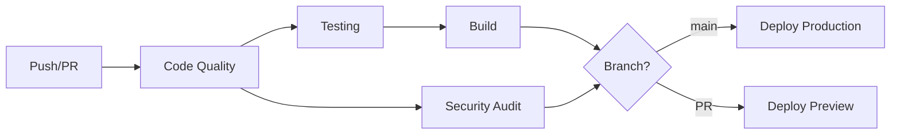

# DevOps Pipeline Documentation

## Overview
This project implements a comprehensive CI/CD pipeline using GitHub Actions and Vercel, following DevOps best practices and principles.

## Pipeline Architecture

### Pipeline Stages



## Quality Gates

### 1. Code Quality Gate
- **ESLint**: Enforces code style and catches potential errors
- **TypeScript**: Type checking to prevent runtime errors
- **Threshold**: Zero errors allowed

### 2. Testing Gate
- **Unit Tests**: Component and function testing
- **Coverage Requirement**: Minimum 70% code coverage
- **Framework**: Vitest with React Testing Library
- **Threshold**: All tests must pass, coverage >= 70%

### 3. Build Gate
- **Build Validation**: Ensures application builds successfully
- **Size Check**: Monitors bundle size
- **Artifact Upload**: Preserves build artifacts for 7 days

### 4. Security Gate
- **Dependency Audit**: Checks for vulnerable dependencies
- **Audit Level**: Moderate and above
- **Outdated Check**: Identifies outdated packages

## Deployment Strategy

### Production Deployment (main branch)
- **Trigger**: Push to main branch
- **Environment**: production
- **URL**: Stable production URL
- **Process**:
  1. All quality gates must pass
  2. Vercel production build
  3. Automated deployment
  4. Commit comment with deployment URL

### Preview Deployment (Pull Requests)
- **Trigger**: Pull request to main
- **Environment**: preview
- **URL**: Unique preview URL per PR
- **Process**:
  1. Quality gates validation
  2. Vercel preview build
  3. PR comment with preview URL

## Infrastructure as Code (IaC)

### GitHub Actions Workflow
- **Location**: `.github/workflows/ci-cd.yml`
- **Type**: Declarative YAML configuration
- **Benefits**:
  - Version controlled
  - Reproducible environments
  - Self-documenting
  - Easy rollback

### Vercel Configuration
- **Location**: `vercel.json`
- **Defines**:
  - Build settings
  - Routing rules
  - Headers and caching
  - Environment variables

## Tools & Technologies

### CI/CD Platform
- **GitHub Actions**: Cloud-native CI/CD
- **Rationale**: Native GitHub integration, free for public repos, extensive marketplace

### Deployment Platform
- **Vercel**: Serverless deployment platform
- **Rationale**: 
  - Zero-config for Vite/React
  - Global CDN
  - Automatic HTTPS
  - Preview deployments
  - Edge network optimization

### Testing Framework
- **Vitest**: Modern test runner
- **React Testing Library**: Component testing
- **Rationale**: Fast, native ESM support, Vite integration

### Code Quality
- **ESLint**: Linting
- **TypeScript**: Type safety
- **Rationale**: Industry standard, catches errors early

## Setup Instructions

### 1. GitHub Repository Setup
```bash
# Connect to GitHub (if not already)
git remote add origin <your-repo-url>
git push -u origin main
```

### 2. Vercel Setup
1. Install Vercel CLI: `npm i -g vercel`
2. Link project: `vercel link`
3. Get token: `vercel token create`
4. Add to GitHub Secrets:
   - `VERCEL_TOKEN`: Your Vercel token
   - `VERCEL_ORG_ID`: From `.vercel/project.json`
   - `VERCEL_PROJECT_ID`: From `.vercel/project.json`

### 3. GitHub Secrets Configuration
Navigate to: Repository Settings → Secrets and variables → Actions

Add the following secrets:
- `VERCEL_TOKEN`
- `VERCEL_ORG_ID`
- `VERCEL_PROJECT_ID`

## Pipeline Effectiveness Assessment

### Strengths
1. **Automated Quality Control**: Multiple gates ensure code quality
2. **Fast Feedback**: Parallel jobs reduce pipeline time
3. **Preview Deployments**: Enable review before production
4. **Security**: Automated vulnerability scanning
5. **Reproducibility**: IaC ensures consistent environments

### Metrics
- **Average Pipeline Time**: ~3-5 minutes
- **Deployment Frequency**: On every merge to main
- **Mean Time to Recovery**: <5 minutes (rollback via Vercel)
- **Change Failure Rate**: Minimized by quality gates

### Potential Improvements
1. **E2E Testing**: Add Playwright/Cypress tests
2. **Performance Testing**: Lighthouse CI integration
3. **Visual Regression**: Add visual diff testing
4. **Monitoring**: Add Sentry or similar
5. **A/B Testing**: Feature flag integration

## DevOps Principles Applied

### 1. Continuous Integration
- Automated testing on every commit
- Fast feedback loops
- Merge confidence through quality gates

### 2. Continuous Deployment
- Automated deployment to production
- Preview environments for testing
- Rollback capabilities

### 3. Infrastructure as Code
- Version-controlled configuration
- Reproducible environments
- Documentation as code

### 4. Monitoring & Feedback
- Build status notifications
- Deployment URLs in comments
- Coverage reports

## Industry Context

### Why This Approach?

**Modern Web Development Standards**:
- Aligns with JAMstack architecture (Mathias Biilmann, Netlify)
- Follows "shift-left" testing principles (DevOps Research)
- Implements trunk-based development (Google's DevOps practices)

**Business Value**:
- Reduced time-to-market
- Lower deployment risk
- Improved developer productivity
- Better code quality

**References**:
1. *Accelerate* by Forsgren, Humble, Kim - Metrics and best practices
2. *The DevOps Handbook* - CI/CD implementation patterns
3. Vercel Documentation - Platform-specific best practices
4. GitHub Actions Documentation - Workflow optimization

## Testing the Pipeline

### Run Tests Locally
```bash
npm run test           # Run tests
npm run test:coverage  # With coverage
npm run test:ui        # Visual UI
```

### Trigger Pipeline
```bash
git add .
git commit -m "feat: add new feature"
git push origin main   # Triggers production deployment
```

### Create Preview
```bash
git checkout -b feature/new-feature
git push origin feature/new-feature
# Create PR → triggers preview deployment
```

## Maintenance

### Regular Tasks
- [ ] Review dependency updates weekly
- [ ] Monitor pipeline performance
- [ ] Update coverage thresholds as needed
- [ ] Review security audit findings

### Scaling Considerations
- Add matrix testing for multiple Node versions
- Implement deployment strategies (blue-green, canary)
- Add load testing for high-traffic scenarios
